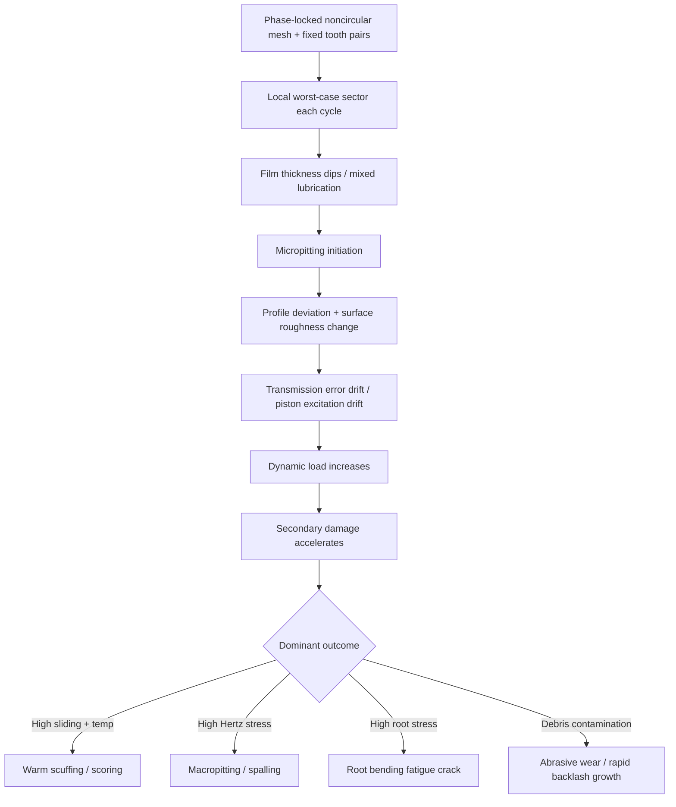
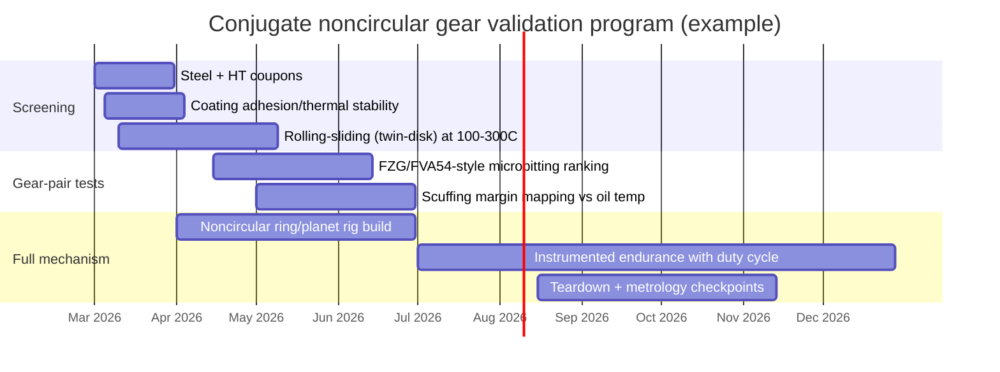

# Novikov and Litvin Gear Approaches for Conjugate Noncircular Planet–Ring Piston Drives

## Executive summary

Your operating envelope (100–300 °C bulk environment, high load, ~14,000 RPM average gear speed with noncircular instantaneous speed variation, forward-only rotation, fixed tooth-pair meshing, and ≥100,000 h target life) is dominated by **tribology + geometry repeatability**, not just classical macropitting/bending rating. Two things make this system unusually unforgiving:

1) **Noncircular kinematics inherently create time-varying pitch-line speeds and mesh forces**, which can increase vibration/bearing forces and produce “worst-case” lubrication segments each cycle (typically at low local speed + high sliding + high temperature). citeturn24view0turn33view0  
2) **Non-hunting / fixed-pair meshing removes the natural averaging mechanism** that spreads manufacturing errors, damage, and wear across many tooth pairs. Industrial high-reliability gearing specifications explicitly require *hunting tooth* combinations to distribute wear; your concept intentionally does the opposite, so you must compensate via surface engineering, metrology, and (optionally) controlled phasing to “synthetically hunt.” citeturn30view0

For the **Novikov–Wildhaber (W‑N) / circular-arc family**, the primary attraction is lower Hertz contact stress via **convex–concave contact** and localized bearing contact; however, the primary disadvantages are **sensitivity to misalignment and center-distance changes** (noise, bearing-contact migration, dynamic excitation). Those disadvantages map directly onto your case (thermal growth, housing deflection, high speed). citeturn15view0turn8view2  
For **Litvin-style noncircular gearing**, the “approach” is not a single tooth shape but a **general conjugate-generation framework** (centrodes/operating pitch lines + enveloping tool surfaces + computerized generation). This is typically the more practical basis for **noncircular internal ring gears and planetary arrangements**, because it is explicitly built around variable pitch geometry and tool paths. citeturn11view2turn9view0turn24view0

On materials: 100–300 °C is high enough that conventional carburized gear steels tempered at low temperature can face **tempering/softening risk** unless you choose “hot-hard” gear alloys or nitrided solutions designed for elevated temperature. citeturn24view1turn15view3turn17view1  
At this temperature and life target, **specific film thickness (lambda ratio)** and surface finish become load-bearing design parameters: NASA correlation work shows gear surface fatigue life increases strongly with increasing specific film thickness, and life in mixed lubrication can be ~an order of magnitude lower than in full-film conditions. citeturn33view0turn32view0  
Therefore, your best leverage is: **(i) hot-hard case material (Pyrowear 53 / M50NiL-class), (ii) superfinished flanks, (iii) lubricant strategy that stays viable near 300 °C, and (iv) micro-geometry matched to the noncircular duty cycle**. citeturn24view1turn15view3turn15view1turn33view1turn26view0

Unspecified (and therefore not numerically rated here): tooth size/module, face width, ring/planet geometry, maximum transmitted torque/contact stress time history, lubrication method (splash/jet), oil type/viscosity–temperature curve, contamination control/filtration, allowable backlash/TE budget, and allowed housing compliance/thermal growth.

## System definition and implications of forward-only, fixed-pair meshing

Your mechanism can be treated as a **noncircular planetary gear train** where a planet (external gear) meshes with a **noncircular internal ring** to generate a prescribed output motion law (piston excitation). In noncircular gearing, the fundamental requirement is that the **operating pitch lines roll without slip**, and the instantaneous transmission ratio is tied to local pitch radii (or their analogs for internal meshing). citeturn13view0turn24view0

Two consequences matter most for tolerances and failure modes:

**Repeatable contact phasing (fixed tooth always meets same valley)**  
This is essentially an extreme **non-hunting** condition. Gear standards for critical service often require hunting-tooth combinations specifically to avoid concentrated wear and repeated damage; API 677, for example, mandates “hunting tooth combinations” and ties allowable tooth accuracy and surface finish to pitch-line velocity. citeturn30view0  
In your system, any of the following will repeat at the same angular phase indefinitely:

- profile/lead error of that tooth pair (manufacturing + heat treat distortion)  
- localized lubrication starvation (e.g., jet shadowing)  
- elastic deflection pattern (mesh stiffness variation)  
- debris entrainment path for that meshing pair

That repeatability is great for motion-law determinism **only if** the initial condition is near-perfect; otherwise, you get deterministic, phase-locked excitation (TE/vibration) and deterministic wear progression.

**Forward-only rotation**  
This yields one-sided flank loading. Your “functional backlash” is no longer symmetric: the loaded flank will wear/polish/micropit, while the unloaded flank remains comparatively pristine. Over time, the *measured* backlash depends on measurement direction and load state (loaded TE vs unloaded geometric backlash). (This is a mechanism-level inference; standards still assume reversal can occur, so your inspection plan must explicitly measure directionality.)

## Geometry and theory differences between Novikov and Litvin approaches

### Novikov–Wildhaber family

Historically, W‑N circular-arc helical gearing traces to **Wildhaber’s 1926 patent** and **Novikov’s 1956 work/patent**; a entity["organization","NASA","us space agency"] gearing reference list explicitly cites Wildhaber’s US patent and Novikov’s USSR patent. citeturn38view0turn37view1  

Key geometric idea: **convex–concave tooth surfaces** with small curvature difference at contact. In the classic Novikov implementation (as summarized in NASA CR work by Litvin et al.), contact is localized (point contact that spreads to an ellipse under load), reducing contact stress versus conventional involute helical gears. citeturn15view0  

Standardized variants exist (one-zone vs two-zone meshing). The two-zone version was introduced to mitigate bending stress penalties that arise with localized contact. citeturn15view0turn8view2  

Practical disadvantages called out in the NASA CR (and echoed in Litvin’s book chapter summary) are exactly the ones your envelope amplifies:
- misalignment can create unacceptable noise/vibration;  
- center-distance changes shift the bearing contact toward addendum/dedendum (and mitigating this can negate stress-reduction benefits). citeturn15view0turn8view2  

**Implication for your noncircular internal ring**: internal-ring layouts plus thermal gradients tend to deliver *both* misalignment and effective center-distance variation as a function of phase. That makes “pure” Novikov gearing risky unless you can guarantee structural/thermal stiffness and/or implement crowned/contact-localized designs with robust TCA-driven modifications. citeturn15view0turn8view2  

### Litvin framework for noncircular conjugate gearing

“Litvin” here is best understood as a **general conjugate surface generation and tooth contact analysis framework**, not one tooth profile. In the Cambridge noncircular gearing excerpt, the breakthrough enabling industrial noncircular gears is described as **enveloping methods (rack cutter/hob/shaper) developed ~1949–1951**, generating the tooth surface as an envelope of tool surfaces; the excerpt explicitly notes noncircular gears can be generated by the **same tool families** as circular gears, with appropriate kinematics. citeturn11view2  

For practical design, a noncircular gear pair is often modeled by two operating pitch lines that roll without slip; the KISSsoft technical note provides equations relating transmission ratio to local pitch radii and reiterates that noncircular gears can be designed from either a specified operating pitch line or a specified transmission-ratio function. citeturn13view0turn24view0  

Crucially for your application, internal noncircular gears are not just “harder to cut”; they can require different tool concepts: the same KISSsoft note states that **a pinion-type cutter is needed** for internal noncircular gears (where a rack reference is only for external forms). citeturn13view0  

**Practical distinction vs Novikov**  
- Novikov: a *specific* high-conformal circular-arc family, attractive for contact stress but sensitive to alignment/center distance. citeturn15view0turn8view2  
- Litvin noncircular approach: a *general* synthesis/generation method (centrodes + envelope generation + computerized tool paths) that is directly aligned with noncircular internal-ring planetary needs. citeturn11view2turn24view0turn9view0  

## Manufacturing tolerances, surface finish, and metrology for high-accuracy noncircular/internal gears

### What “good” looks like in standards-based gearing

Even though most mainstream standards are written for involute cylindrical gears, they provide a useful baseline for achievable accuracy and inspection language:

- **ISO 1328‑1** defines a tolerance classification system for *manufacturing and conformity assessment of tooth flanks of individual cylindrical involute gears*. citeturn15view2turn2search0  
- **AGMA 2015** (via an AGMA/ANSI preview info sheet) structures tolerances around pitch deviations, profile tolerances, helix tolerances, and composite deviations across accuracy grades A2–A11. citeturn28view0turn28view1  

A highly relevant “real-world” spec is **API 677** (general-purpose gear units for petroleum/chemical/gas). It ties accuracy and finish requirements explicitly to pitch-line velocity, for example:
- ISO 1328 Grade 8/7/6/5 thresholds depending on pitch-line velocity bands,  
- tooth surface finish on loaded faces measured along the pitch line (0.8 µm Ra above 20 m/s; 1.6 µm Ra at or below 20 m/s),  
- and a requirement for hunting-tooth combinations. citeturn30view0  

For your case, API 677 is not directly applicable (noncircular conjugate fixed-pair), but it is a strong indicator of what industrial practice considers necessary as pitch-line velocity rises.

### Surface finish as a life lever (micropitting and wear)

The AGMA technical paper from entity["company","REM Chemicals, Inc.","Lakewood, NJ, US"] on superfinishing shows quantitative roughness and damage differences in FZG micropitting testing:

- baseline gears: average Ra ≈ 0.47–0.48 µm; superfinished: average Ra ≈ 0.095–0.10 µm, with some flanks down near ~0.07 µm. citeturn14view0turn15view1  
- in their reported endurance sequence, baseline gears showed severe micropitting coverage, while superfinished gears exhibited negligible profile deviation and essentially no micropitting under the same protocol. citeturn14view0turn15view1  

Given your non-hunting fixed-pair condition, I would treat **Ra ≤ 0.10 µm** as a realistic starting requirement for the loaded flanks (with tighter local specifications on Rz/Rq and directionality), not a luxury. That recommendation is consistent with how specific film thickness depends on composite roughness and how gear life drops sharply in mixed lubrication. citeturn33view0turn33view1  

### Metrology strategy for noncircular conjugate gears

Because noncircular gear strength/geometry is not universally standardized, the KISSsoft note explicitly states **strength calculation is not standardized** and suggests replacement-gear approximations. citeturn13view0turn24view0  
That same lack of standardization exists for inspection if you only rely on “gear grade” labels.

For this application, inspection should be **functional + local**:

- **Functional roll testing / transmission error (TE)**: TE is the most direct proxy for “motion law preservation.” (Use high-resolution encoders, measure under representative torque and temperature to capture elastic + thermoelastic contributions.) NASA and NREL work underline that lubrication regime and roughness can dominate surface durability; TE lets you detect the consequences early. citeturn33view0turn33view1  
- **Local flank scanning**: evaluate profile/lead error as a function of noncircular phase angle. Treat each phase sector as its own “equivalent circular gear” segment for specifying allowable flank deviations (an engineering approach consistent with the “replacement gear” concept used for approximations). citeturn13view0turn24view0  
- **Pattern/contact checks**: API 677 describes shop contact checking with compound/transfer materials and prescribes shaft parallelism and expected contact distribution concepts that can be adapted to your internal ring (with your own acceptable contact map). citeturn29view0turn30view0  

## Dominant failure modes in your envelope and what the fixed-pair constraint changes

Your risk stack is not a single mode; it is a coupled progression where early-stage surface damage changes backlash/TE and then drives dynamic load amplification.

The ISO 6336 series structure is useful here: parts 1–6 handle fatigue rating (pitting, bending, etc.), while parts 20–29 address **tribological flank behavior** (scuffing, micropitting). ISO/TS 6336‑21 explicitly defines “warm scuffing” and describes scuffing as welding/seizure due to lubricant film breakdown; it also highlights that scuffing risk depends on lubricant, roughness, sliding velocities, load, contaminants, and that scuffing can increase vibration/dynamic load and trigger further damage. citeturn26view0turn25view0  

### Failure-mode mechanisms, with fixed-pair and forward-only modifiers

**Micropitting (gray staining) → profile deviation → TE drift**  
Micropitting is strongly tied to mixed lubrication where asperity contact carries part of the load. The NREL preprint describing ISO/TS 6336‑22 states the method assumes micropitting occurs when **minimum specific film thickness** falls below a permissible value, and defines specific film thickness (lambda ratio) as film thickness divided by effective roughness. citeturn33view1turn26view0  
NASA correlational work indicates that when specific film thickness is <1, life can drop substantially (bearing and gear data show clear regime behavior), and mixed lubrication life can be ~11% of full-film life in their compiled comparisons. citeturn33view0turn32view0  

**Fixed-pair effect:** micropitting will not “average out” tooth-to-tooth. Once a particular tooth pair develops micro-damage, that same pair keeps reloading the damaged region every cycle, so micropits can coalesce into localized wear steps—exactly the sort of thing that corrupts a motion law.

**Macropitting / pitting (surface fatigue)**
Classically rated via ISO 6336 pitting methods (Part 2). For your case, expect pitting to be highly phase-dependent because your local pitch line velocity and sliding change with noncircular phase. ISO/TR 15144‑1 notes its micropitting procedure was developed from oil-lubricated gear transmissions over modules 3–11 mm and pitch line velocities 8–60 m/s; if your local pitch-line velocities fall outside that range, you may be extrapolating. citeturn31search7turn30view0  

**Scuffing / scoring (adhesive wear and seizure)**
ISO/TS 6336‑21 describes scuffing as seizure/welding due to lubricant film breakdown at high temperature and pressure, and emphasizes its dependence on roughness and sliding velocity; it also warns that scuffing can rapidly escalate into dynamic loading and secondary failures. citeturn26view0turn25view0  

**Fixed-pair + forward-only effect:** scuffing risk concentrates on the single loaded flank and on the same sliding path every cycle. If your jet lubrication has angular shadowing, one phase sector can become your scuffing trigger point.

**Tooth root bending fatigue**
Noncircular gear trains can have strongly varying mesh force and torque; thus root stress is not constant. NASA’s gear-alloy work includes single-tooth bending fatigue style testing context and emphasizes matching fillet geometry for stress comparisons. citeturn17view0  

**Fixed-pair effect:** if one tooth root sees a repeated peak (same phase always), a single weakest tooth can become the life limiter. Hunting ratios normally reduce “weakest tooth” sensitivity; you don’t have that safety net. citeturn30view0  

**Wear (mild wear, polishing wear, abrasive wear) → backlash growth**
Wear changes tooth thickness and thus backlash. NASA’s specific-film work notes wear rates depend strongly on lubricant viscosity (example discussion shows significant wear-rate reductions with higher viscosity). citeturn33view0turn32view0  
In fixed-pair meshing, mild wear can actually become self-stabilizing (surfaces conform), but only if contamination is controlled and lubrication stays in a favorable regime; otherwise it becomes a deterministic backlash drift mechanism.

### Failure progression map

## Materials, heat treatment, and coatings for 100–300 °C duty

### Why “hot hardness” matters at 300 °C

Many carburized gear steels are tempered at relatively modest temperatures to keep very high case hardness; exposure at 300 °C can continue tempering and reduce hardness unless the alloy is designed for temper resistance. Pyrowear 53’s datasheet explicitly positions it as having greater case temper resistance than conventional carburizing alloys (9310/3310/8620). citeturn17view2turn24view1  
For high-hot-hardness materials, NASA’s study of M50NiL vs 9310 notes that high-hot-hardness materials can extend operating life at higher temperatures and can lengthen operating time during lubrication/cooling failures; their gear tests cite 10,000 rpm as a representative test speed for surface fatigue investigations. citeturn17view1turn35search3  

### Candidate substrate materials (with relevant temperature capability evidence)

| Candidate | Typical treatment path | What the sources confirm | Practical take for your use case |
|---|---|---|---|
| 9310 (baseline aerospace carburizing steel) | Carburize + quench + low temper + grind/superfinish | NASA gear-alloy comparison reports average core hardness ~37 HRC for 9310 test gears (context: comparison set). citeturn17view0 | Works well in many aerospace gearboxes, but **not the first choice for sustained 300 °C** unless you validate hardness retention and scuffing margin. |
| Pyrowear 53 (premium carburizing gear steel) | Carburize + quench + sub-zero + temper; finish grind + superfinish | Datasheet provides **case/core hardness vs tempering temperature**; at 288 °C tempering, case hardness shown ~61 HRC and core ~35 HRC. citeturn24view1turn17view2 | Strong candidate for 100–300 °C because temper resistance is explicit and quantified. Pair with aggressive surface finish control. |
| CBS‑50 NiL / M50NiL-class carburizing steel | Carburize + heat treat; designed for elevated temperature rolling contact fatigue | Carpenter datasheet: designed for **service temperatures up to 600 °F (316 °C)** and intended for aircraft engine bearings and gears. citeturn15view3 NASA: M50NiL developed to improve fracture toughness while retaining hot hardness; gear tests compare to 9310. citeturn17view1 | Probably the most “on-the-nose” steel class for your 300 °C target, especially if you are truly near that temperature for long durations. |
| Ferrium C61 / C64-class ultra-high-strength gear alloys (NASA test context) | Carburize + optimized heat treat; finish grind | NASA TM reports peak case hardness ~61–63 HRC and core hardness ~48–49 HRC for C61/C64 test gears; compares to Pyrowear 53 and 9310. citeturn17view0 | Attractive if you need **higher core strength/toughness** while maintaining hard case; availability/cost/processing complexity higher. |
| Nitrided CrMoV steels (example: 31CrMoV9) | Q&T core + gas/plasma nitriding; optional post-oxidation | Swiss Steel datasheet indicates gas nitriding can achieve surface hardness **650–800 HV0.5** for 31CrMoV9. citeturn21view0 | Nitriding is attractive for dimensional stability (lower distortion) and elevated-temperature surface stability, but the layer is thinner than carburized case and requires careful contact stress design. |
| INCONEL 718 (Ni-base superalloy) | Solution + age harden; optionally coat | Special Metals bulletin shows room-temperature hardness values ranging from low 20s Rc (as-rolled) up to mid‑40s Rc for aged conditions in listed product examples. citeturn42view0 | Excellent strength/oxidation at temperature, but **hardness is far below carburized/nitrided gear flanks**; would rely heavily on coatings and may struggle in rolling contact fatigue vs hard steels. Use only if corrosion/temperature forces it. |

### Coatings and duplex surface concepts at 100–300 °C

At 300 °C, coating selection must consider **thermal stability + adhesion + counterpart behavior + lubricant compatibility**.

- **CrN (PVD/sputtered)**: Oerlikon Balzers lists CrN coating properties and a maximum service temperature of ~700 °C for BALINIT CNI, and emphasizes use for high-temperature sliding applications (e.g., exhaust valves, piston rings). citeturn43view2  
- **ta‑C / high-temperature DLC variants**: Platit’s coating guide lists ta‑C (DLC3) with max service temperature ~500 °C and very high nanohardness; other DLC types are listed lower (~400–450 °C). citeturn43view3  
- **Si-doped ta‑C thermal stability**: a Scientific Reports paper reports Si–ta‑C coatings stable up to ~600 °C and, at sufficient Si content, stable behavior up to ~700 °C in their annealing/stability evaluation. citeturn43view1  
- **High-temperature DLC behavior nuance**: some multilayer/engineered DLC systems can retain favorable friction at elevated temperature (studies report low friction up to several hundred °C in specific constructions), but performance is system-specific and must be tested under your lubricant and sliding severity. citeturn4search0turn43view1  

**Strong opinion (engineering):** for a 300 °C geared contact, I would not “bet the gearbox” on a generic hydrogenated DLC unless you have direct test data at temperature; I would prioritize **CrN/AlCrN-class nitrides** or **high-temperature ta‑C variants**, and I would treat coatings as **scuffing insurance + friction control**, not as a substitute for inadequate steel hot hardness or inadequate film thickness. Coating data sheets and ISO scuffing guidance both reinforce that scuffing is acutely sensitive to roughness, sliding, load, and contaminants. citeturn43view2turn26view0  

## Wear and backlash evolution over 100,000 hours

### Why this is hard to “predict” without your load history

Noncircular gear strength rating is not standardized in a universal way, and even KISSsoft explicitly notes a need for special/approximate methods for noncircular gears. citeturn13view0turn24view0  
For your 100,000 h requirement, you should think in terms of **regime control** and **drift budgets**, not a single deterministic wear curve.

### A practical wear/backlash model for fixed-pair, forward-only meshing

A defensible, mechanism-relevant model has three phases:

**Run-in phase (hours to tens of hours, application-dependent)**  
- asperity truncation/polishing produces rapid initial changes in surface topography;  
- in fixed-pair systems, run-in can “mate” the tooth/valley pair and reduce local stress concentrations **if** cleanliness is high and scuffing is avoided.

Superfinishing materially reduces the severity of damaging run-in mechanisms in micropitting tests and pushes the system toward mild wear rather than micropitting-driven profile loss. citeturn15view1turn14view0  

**Steady phase (dominant life)**  
If you maintain **specific film thickness** above the mixed regime for most of the cycle, surface fatigue life increases dramatically. NASA work shows gear life correlates strongly and nonlinearly with specific film thickness and that full-film regimes can provide multiple‑× relative life compared to mixed regimes. citeturn33view0turn32view0  
At 100–300 °C, viscosity drops sharply; therefore, without very high viscosity index fluids or specialized high‑temperature lubricants, your lambda ratio will collapse during the hottest segments. The NREL preprint also emphasizes ISO/TS 6336‑22’s emphasis on minimum specific film thickness across the mesh, not a single average point. citeturn33view1turn26view0  

**Late-life acceleration (if damage initiates)**  
Once profile deviation grows, TE grows. TE growth drives dynamic load, which ISO scuffing guidance explicitly warns can escalate damage (scuffing ↔ vibration ↔ dynamic load loop). citeturn26view0turn25view0  

### Sensitivities you should treat as first-class design parameters

**Surface finish sensitivity**  
The REM/AGMA testing shows roughness reductions from ~0.47 µm average to ~0.10 µm average corresponded to a dramatic increase in micropitting endurance under their protocol. citeturn15view1turn14view0  

**Lubrication temperature sensitivity**  
ISO scuffing methods (6336‑20/‑21) explicitly model scuffing risk via contact temperature methods and highlight that scuffing can be triggered by a single overload event, unlike fatigue which accumulates over long durations. citeturn26view0turn26view1  

**Load sensitivity**  
Pitting/scuffing are both strongly load-sensitive. In your noncircular system, peak load may occur in a short phase window; rating must be time-resolved (duty cycle).

### Using controlled sun-gear rotation variation to manage wear/backlash

Because fixed-pair meshing removes hunting, the standard mitigation is to reintroduce distribution artificially. API 677’s explicit requirement for hunting-tooth combinations exists to distribute wear and avoid repeated contact. citeturn30view0  
Your mechanism constraint prevents classic tooth-number hunting, but you can still accomplish **wear distribution in two ways**:

1) **Micro-phase indexing**: slowly change the relative phasing between planet and ring over long time (e.g., very small incremental sun/planet carrier phase adjustments) so that the loaded contact patch migrates along the flank instead of re-tracing the identical path.  
2) **Controlled backlash biasing**: if your design allows a controlled sun rotation that effectively changes the contact position within the tooth thickness, you can bias load toward a less-worn region and maintain a near-constant effective backlash under load (at the cost of more control complexity).

These are design-inference recommendations; to validate them, you need a TE/backlash drift model tied to microgeometry and your control law.

## Design mitigations, inspection, and condition monitoring to preserve the motion law

### Micro-geometry modifications tuned to noncircular phase

For high-speed, high-load gears, microgeometry (lead crowning, profile relief, localized modifications) is often the difference between “works in CAD” and “works for 100k hours.” Novikov-family gears *already* localize contact; the NASA CR notes their bearing contact direction and sensitivity tradeoffs, and Litvin’s chapter summary explicitly mentions transmission error discontinuities and high acceleration during tooth transfer under misalignment. citeturn15view0turn8view2  

In your fixed-pair system, you can exploit phase determinism:

- implement **phase-dependent profile relief** so the most severe sliding zones have lower contact stress and lower frictional heat generation;  
- implement **phase-dependent lead crowning** to tolerate predicted housing/thermal deflection at that phase;  
- use **superfinish + controlled isotropic texture** (reduce directionality) because directionality can interact with sliding direction and accelerate micropitting. citeturn15view1turn14view0  

### Monitoring metrics that map to piston excitation fidelity

A monitoring program must detect *drift* before catastrophic failure. The NREL ISO/TS 6336‑22 discussion is explicit that the method predicts *where* micropitting would occur (minimum film thickness region) and that safety factor selection depends on consequences and reliability requirements. citeturn33view1turn26view0  

For your system, I would instrument around three observables:

1) **Transmission error (TE) under representative load** (directly linked to motion law drift).  
2) **Vibration / order tracking** keyed to noncircular phase (detects repeating tooth-pair damage).  
3) **Lubricant condition** (particle count/ferrous debris + viscosity surrogate + temperature). ISO scuffing guidance explicitly flags contaminants/metal particles as scuffing-risk multipliers. citeturn26view0turn25view0  

Additionally, you should retain the ability to do periodic **direct flank inspection** (replicas + microscopy/white-light interferometry) to quantify micropitting area, roughness changes, and wear steps.

## Test protocols and accelerated life validation

### Why you need a staged, multi-level test program

A single accelerated test often changes the dominant failure mode (e.g., you accelerate by temperature and suddenly scuffing dominates, masking long-term micropitting). ISO scuffing guidance also emphasizes scuffing can be triggered by short overloads, while fatigue evolves over long time. citeturn26view0turn26view1  

Therefore, validation should be layered:

**Component/material tribology screening** (weeks)  
- twin-disk / rolling–sliding contact tests at representative maximum Hertz stress and slip ratio, over 100–300 °C, comparing steel + heat treat + coating + lubricant combinations;  
- scuffing propensity screening aligned with ISO scuffing concepts (temperature-based risk) and your lubricant candidates. citeturn26view0turn26view1  

**Gear pair testing** (months)  
- FZG-style micropitting/scuffing tests are widely used for ranking; the REM/AGMA paper uses FVA 54 micropitting procedures and shows clear finish sensitivity. citeturn15view1turn14view0  
- Use phase-matched duty cycles (variable speed, variable torque) rather than constant conditions.

**Full mechanism test** (months to year)  
- torque-recirculating rig with the actual noncircular ring/planet geometry, running your real speed profile and temperature field;  
- measure TE-to-piston excitation transfer and drift.

### Metrics to measure

From an engineering controls perspective (preserving motion law), these are the highest value metrics:

- **Backlash vs phase and temperature**, both unloaded geometric and loaded effective (TE-based).  
- **Transmission error waveform** and its evolution.  
- **Surface roughness evolution** (Ra/Rq/Rz + directionality) on the loaded flank path.  
- **Micropitting area fraction** and location vs phase.  
- **Scuffing onset margin** (torque/temperature boundary). citeturn26view0turn33view1  

### Example accelerated test timeline

### Prioritized research and reference set

**Foundational geometry and theory**
- Litvin et al. noncircular gearing excerpt on enveloping generation (1949–1951) and use of common tools. citeturn11view2  
- KISSsoft noncircular gear theory note (operating pitch lines, kinematics equations, internal gear cutter requirement, and non-standardized strength). citeturn24view0turn13view0  
- Litvin chapter summary on Novikov–Wildhaber helical gears (Wildhaber 1926, Novikov 1956; point vs line contact; misalignment/TE issues). citeturn8view2turn15view0  

**Standards and test frameworks**
- ISO 1328‑1 (gear flank tolerance classification system scope and structure). citeturn15view2turn2search0  
- ISO/TS 6336‑20 and 6336‑21 introductions and scuffing definition, scuffing risk factors, and role of tribological parts in ISO 6336 series. citeturn26view0turn26view1turn25view0  
- API 677 (gear accuracy grade vs pitch-line velocity, surface finish requirements, and hunting tooth requirement). citeturn30view0  
- NREL ISO/TS 6336‑22 case study preprint (specific film thickness/lambda framing and permissible film thickness logic). citeturn33view1turn33view0  

**Failure physics and life sensitivity**
- NASA work on specific film thickness/lambda ratio and its correlation to gear life (and linkage to AGMA 925 lubrication regime framing). citeturn33view0turn32view0  
- REM/AGMA superfinishing and micropitting test data (quantified Ra values and damage outcomes). citeturn15view1turn14view0  

**Materials and datasheets**
- Pyrowear 53 datasheet (case/core hardness vs tempering temperature; temper resistance claim). citeturn24view1turn17view2  
- CBS‑50 NiL datasheet (designed service temperature up to 316 °C; bearing/gear intent). citeturn15view3  
- NASA gear alloy comparison data (core/case hardness comparisons across Pyrowear 53, 9310, and advanced alloys). citeturn17view0  
- Special Metals INCONEL 718 bulletin (hardness values in representative conditions). citeturn42view0  
- Coating capability references (CrN service temperature; ta‑C service temperature ranges). citeturn43view2turn43view3turn43view1