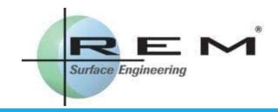

## Case Study of ISO/TS 6336-22 Micropitting Calculations

ROBIN OLSON, REXNORD CORPORATION, MARK MICHAUD, REM SURFACE ENGINEERING, AND JONATHAN KELLER, NATIONAL RENEWABLE ENERGY LABORATORY 2020 FALL TECHNICAL MEETING

OCTOBER 20, 2020

