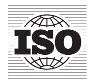

## INTERNATIONAL

STANDARD

ISO

15550

## Internal combustion engines — Determination and method for the measurement of engine power — General requirements

Moteurs à combustion in terne — Déterm ination et méthode de mesure de la puissance du moteur — Exigences générales

ISO 15550 : 2 016(E )