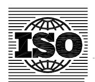

## INTERNATIONAL STANDARD

**ISO 18669-1**

> Second edition 2013-07-15

## **Internal combustion engines — Piston pins —**

Part 1: **General specifications**

*Moteurs à combustion interne — Axes de pistons — Partie 1: Spécifications générales*

Reference number ISO 18669-1:2013(E)