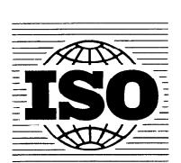

## INTERNATIONAL STANDARD

ISO 6336-3

First edition 1996-06-15

## Calculation of load capacity of spur and helical gears —

iTeh SPart 3: ARD PREVIEW Calculation of tooth bending strength (standards.iteh.ai)

ISO 6336-3:1996

https://standards.it.Galcul.de.da.capacité.de.charge.des.engrenages cylindriques à dentures droite et hélicoidale. 36-3-1996

Partie 3: Calcul de la résistance à la flexion des dents

