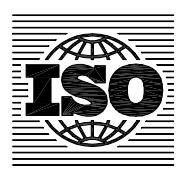

## INTERNATIONAL STANDARD

**ISO 6621-2**

> Second edition 2003-11-15

## **Internal combustion engines — Piston rings —**

Part 2: **Inspection measuring principles** 

*Moteurs à combustion interne — Segments de piston — Partie 2: Principes de mesure pour inspection* 

