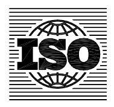

## INTERNATIONAL STANDARD

**ISO 6622-1**

> Second edition 2003-12-01

## **Internal combustion engines — Piston rings —**

Part 1:

**Rectangular rings made of cast iron** 

*Moteurs à combustion interne — Segments de piston — Partie 1: Segments rectangulaires en fonte moulée* 

