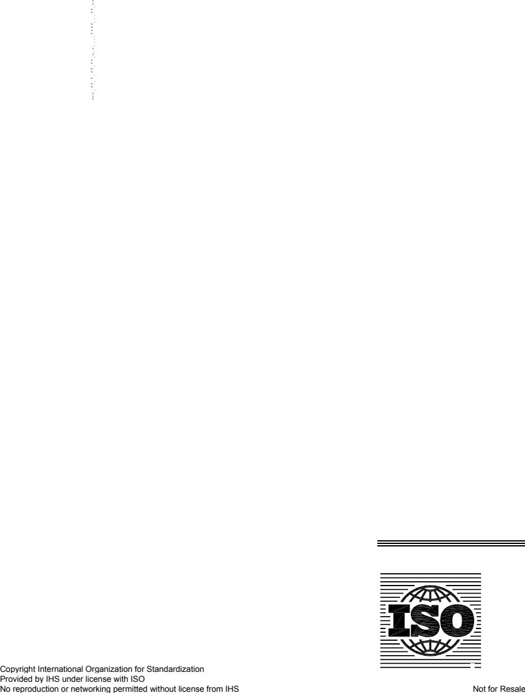

## INTERNATIONAL STANDARD

**ISO 6627**

Second edition 2011-08-01

## **[Internal combustion engines — Piston](#page-6-0) [rings — Expander/segment oil-control](#page-6-0) [rings](#page-6-0)**

*[Moteurs à combustion interne — Segments de piston — Segments](#page-6-0)  [racleurs régulateurs d'huile/Ressorts d'expansion](#page-6-0)* 

