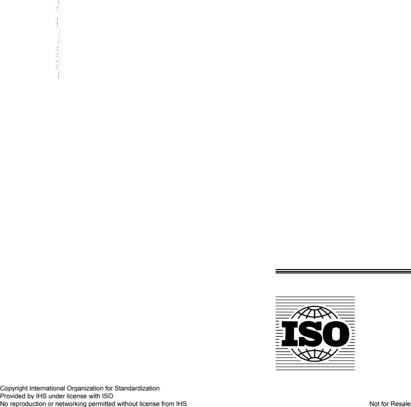

## INTERNATIONAL STANDARD

**ISO 14635-1**

> First edition 2000-06-01

## **Gears — FZG test procedures —**

## Part 1:

**FZG test method A/8,3/90 for relative scuffing load-carrying capacity of oils**

Engrenages — Méthodes d'essai FZG —

Partie 1: Méthode FZG A/8,3/90 pour évaluer la capacité de charge au grippage des huiles

Reference number ISO 14635-1:2000(E)