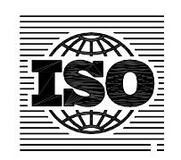

## INTERNATIONAL STANDARD

**ISO 14635-2**

> First edition 2004-04-01

## **Gears — FZG test procedures —**

## Part 2:

**FZG step load test A10/16, 6R/120 for relative scuffing load-carrying capacity of high EP oils** 

*Engrenages — Méthodes d'essai FZG —* 

*Partie 2: Méthode FZG A10/16, 6R/120 à paliers de charge pour évaluer la capacité de charge au grippage des huiles à valeurs EP élevées* 

