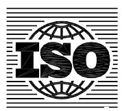

## INTERNATIONAL STANDARD

**ISO 14635-3**

> First edition 2005-09-15

## **Gears — FZG test procedures —**

Part 3:

**FZG test method A/2,8/50 for relative scuffing load-carrying capacity and wear characteristics of semifluid gear greases** 

*Engrenages — Méthodes d'essai FZG —* 

*Partie 3: Méthode FZG A/2,8/50 pour évaluer la capacité de charge au grippage et les caractéristiques d'usure des graisses d'engrenages semi-fluides* 

Reference number ISO 14635-3:2005(E)

Reproduced by IHS under license with ISO