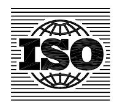

## **INTERNATIONAL STANDARD ISO 6336-2:2006** TECHNICAL CORRIGENDUM 1

Published 2008-06-01

INTERNATIONAL ORGANIZATION FOR STANDARDIZATION • МЕЖДУНАРОДНАЯ ОРГАНИЗАЦИЯ ПО СТАНДАРТИЗАЦИИ • ORGANISATION INTERNATIONALE DE NORMALISATION

## **Calculation of load capacity of spur and helical gears —** Part 2:

## **Calculation of surface durability (pitting)**

TECHNICAL CORRIGENDUM 1

*Calcul de la capacité de charge des engrenages cylindriques à dentures droite et hélicoïdale — Partie 2: Calcul de la résistance à la pression de contact (piqûre)* 

*RECTIFICATIF TECHNIQUE 1*

Technical Corrigendum 1 to ISO 6336-2:2006 was prepared by Technical Committee ISO/TC 60, *Gears*, Subcommittee SC 2, *Gear capacity calculation*.

*Page 3, 5.1 d)* 

Replace "Helical gears with εαu 1 and with ε γ > 1" with

Helical gears with εα < 1 and with ε γ > 1

*Page 8, 5.4.3.2* 

Replace Equation (15) with the following:

$$exp = 0.768 6 log \frac{\sigma_{HP stat}}{\sigma_{HP ref}}$$

**ICS 21.200 Ref. No. ISO 6336-2:2006/Cor.1:2008(E)**