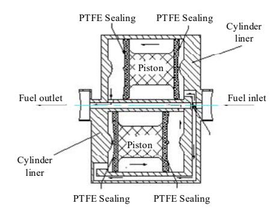
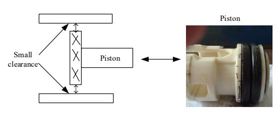

## 1XPHULFDO6LPXODWLRQRI/XEULFDWLRQ)LOPLQ3LVWRQ 5LQJRI)XHO'LVSHQVHU)ORZPHWHU%DVHGRQ +\GURG\QDPLF/XEULFDWLRQ

/LX<DMXQ
/XR4L=KDQJ6KHQFKDR:DQJ/L\D 6FKRRORI0HFKDQLFDODQG\$XWRPRWLYH(QJLQHHULQJ 6RXWK&KLQD8QLYHUVLW\RI7HFKQRORJ\ \*XDQJ]KRX&KLQD HPDLO\DMXQ#VFXWHGXFQ

*Abstract***²+\GURG\QDPLF OXEULFDWLRQ LV DQ LGHDO VWDWH RI OXEULFDWLRQLQWKDWIULFWLRQDQGZHDUKDUGO\RFFXU7KHIULFWLRQSDLU RISLVWRQULQJF\OLQGHUOLQHULVRQHRIWKHPRVWLPSRUWDQWIULFWLRQ SDLUVLQDIORZPHWHU:LWKWKHGHYHORSPHQWRIIORZPHWHUDLPLQJDW KLJKSUHFLVLRQ DQG KLJKVWDELOLW\ KRZ WR PDNH WKH SLVWRQ ULQJ F\OLQGHU OLQHU V\VWHP PDLQWDLQ D JRRGOXEULFDWLRQ FRQGLWLRQ KDV JUHDWLPSRUWDQFHLQWHUPVRIUHGXFLQJWKHIULFWLRQDQGZHDU,QWKLV SDSHU D K\GURG\QDPLF OXEULFDWLRQ PDWKHPDWLFDO PRGHO RQ WKH VXUIDFH RI SLVWRQ ULQJ ZDV HVWDEOLVKHG\$QG WKH ILQLWH GLIIHUHQFH PHWKRG)'0DQGVXFFHVVLYHRYHUUHOD[DWLRQPHWKRG625ZHUH DGRSWHG WR VROYH WKH PDWKHPDWLFDO PRGHO QXPHULFDOO\ 7KH GLPHQVLRQOHVVDYHUDJHSUHVVXUHRIWKHOXEULFDWLRQILOPZDVWDNHQ DV WKH FULWHULRQ WR HVWLPDWH WKH K\GURG\QDPLF OXEULFDWLRQ SHUIRUPDQFH RI WKH SLVWRQ ULQJ DQG WKH HIIHFWV RI GLIIHUHQW IORZ UDWHFRQGLWLRQVGLIIHUHQWIOXLGYLVFRVLWLHVDQGGLIIHUHQWPLQLPXP ILOPWKLFNQHVVHVRQWKHOXEULFDWLRQILOPSUHVVXUHGLVWULEXWLRQZHUH LQYHVWLJDWHG UHVSHFWLYHO\ 7KH QXPHULFDO DQDO\VLV UHVXOWV UHYHDO WKDW D WKH DYHUDJH SUHVVXUH GHFUHDVHV ZLWK WKH LQFUHDVH RI PLQLPXP ILOP WKLFNQHVV XQGHU WKH FRQGLWLRQ RI WKH VDPH PLQLPXPILOPWKLFNQHVVZKHQWKHPHGLXPLVGLHVHOWKHDYHUDJH SUHVVXUHLVJUHDWHUWKDQWKHDYHUDJHSUHVVXUHZKHQWKHPHGLXPLV JDVROLQH E WKH OXEULFDWLRQ ILOP SUHVVXUH LQFUHDVHV ZLWK WKH LQFUHDVHRIIORZUDWHDQGWKHIORZUHJLPHRIWKHOXEULFDWLRQILOP FKDQJHVZLWKWKHFKDQJHRIIORZUDWHFDVWKHYLVFRVLW\LQFUHDVHV WKHSUHVVXUHLQFUHDVHVDVZHOOIRUWKHVDPHOHDNDJHFOHDUDQFHWKH KLJKHU WKH YLVFRVLW\ WKH ODUJHU ORDGFDUU\LQJ FDSDFLW\ RI WKH FOHDUDQFH OXEULFDWLRQ ILOP7KHVH UHVXOWV SURYLGH D JXLGDQFH IRU OXEULFDWLRQGHVLJQRISLVWRQULQJF\OLQGHUOLQHUIULFWLRQSDLU**

 *Keywords-lubrication film; piston ring; flowmeter; finite difference method; hydrodynamic lubrication (key words)* 

## , ,1752'8&7,21

7KH GLVSHQVHULV D IXHOSXPSLQJDQGPHDVXUHPHQW GHYLFH XVHGLQWKHVHUYLFHVWDWLRQ)ORZPHWHULVWKHFRUHFRPSRQHQWRI WKH GLVSHQVHUPHWHULQJ V\VWHPWKDWPHDVXUHVWKH IXHO YROXPH ZKLFKLVWR EH JLYHQWRWKH FXVWRPHUV \$W SUHVHQWPRVW IXHO GLVSHQVHU IORZPHWHUV DUH SRVLWLYHGLVSODFHPHQW SLVWRQ W\SHV 7KHSLVWRQVDUHDFWLYDWHGE\WKHIORZRIIXHOIURPWKHSXPSLQJ V\VWHPDQGDUHPRXQWHGLQSDUDOOHOF\OLQGULFDOOLQHUV\$FDVHRI SLVWRQ ULQJF\OLQGHUOLQHULQD IORZPHWHU V\VWHPLV VKRZQLQ )LJXUH,QWKLVFDVHWKHSLVWRQULQJVDUHSXVKHGE\WKHIXHODQG UHFLSURFDWH LQ WKH F\OLQGHU OLQHU 7KHUH LV D VPDOO VHDOLQJ FOHDUDQFH EHWZHHQWKH SLVWRQ ULQJ DQGWKHF\OLQGHUOLQHU7KH FOHDUDQFHLVQHFHVVDU\WRHQVXUHIOH[LEOHPRYHPHQWRIPRYLQJ SDUWV WR UHGXFH SUHVVXUH ORVV DQG ZHDU EXW DOVR WR PDNH WKH LQWHUQDO OHDNDJH DVOLWWOH DV SRVVLEOH ,QWKHRU\ WKH FOHDUDQFH GHVLJQYDOXHVKRXOGEH]HUREXWLQIDFWLWLVGLIILFXOWWRDFKLHYH )RUH[DPSOHWKHFOHDUDQFHV EHWZHHQ URWRUDQG VKHOO RIZDLVW ZKHHO IORZPHWHU DQG RYDO JHDU IORZPHWHU DUH JHQHUDOO\ GHVLJQHGLQPPRUVRJHQHUDOO\QRWPRUHWKDQPP>@ \$VLPSOHPRGHORIDSLVWRQULQJF\OLQGHUOLQHU IULFWLRQSDLULV LOOXVWUDWHGLQ)LJXUH>@

)LJXUH 3LVWRQULQJF\OLQGHUOLQHULQDIORZPHWHUV\VWHP

)LJXUH \$VLPSOHPRGHORIDSLVWRQULQJF\OLQGHUOLQHUIULFWLRQSDLU

,Q JHQHUDO WKH LQWHUQDO OHDNDJH GLUHFWO\ DIIHFWV WKH PHDVXUHPHQW DFFXUDF\>@ 7KH LQWHUQDO OHDNDJH LV UHODWHG WR PDQ\ IDFWRUV VXFK DV WKH SULQFLSOH RI PHDVXUHPHQW PDQXIDFWXULQJ DQG DVVHPEO\ WKH FKDUDFWHULVWLFV RI PHGLXP SDUDPHWHUV WKH IORZ UHJLPH DQG VR RQ 5HFHQWO\ PDQ\ DWWHQWLRQVKDYHEHHQSDLGIRUWKHPHFKDQLVPRILQWHUQDOOHDNDJH :HQJ HW DO>@ GLVFXVVHG WKH HIIHFW RI YLVFRVLW\ RQ WKH SHUIRUPDQFH RI WXUELQH IORZPHWHU DQG LPSURYHG WKH IORZ PHWHUPRGHORIFXUUHQWWXUELQHIORZPHWHUE\WKHG\QDPLFVRI YLVFRXVIOXLG;XHWDO>@LQYHVWLJDWHGWKHHIIHFWVRIYLVFRVLW\ DQG GHQVLW\ FKDQJLQJ RQ PHDVXUHPHQW DFFXUDF\ EDVHG RQ SRVLWLYHGLVSODFHPHQWPHWHU:DQJHWDO>@DQDO\]HGWKHHIIHFWV